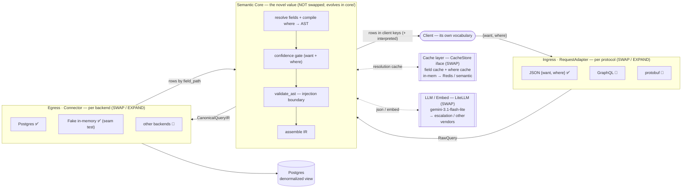

# System design — sans_schema gateway

Maintained (source of truth) · the **glanceable component map**: the boxes and how
they swap. For the exact contract shapes, rules, and invariants, see
[`architecture.md`](architecture.md); for the current milestone's scope, see the
newest [`specs/`](specs/) entry.

**Division of labour** — keep these two maintained docs from drifting:
- **this doc** = *topology + swap points* (what are the components, what interface
  each sits behind, what swaps in later).
- **`architecture.md`** = *the law* (request contract, IR shapes, resolution
  discipline, prompt-cache layout).

**Update when:** a component, interface, or swap point changes — in the **same**
change, and log it in [`devlog.md`](devlog.md).

**Status legend:** ✅ implemented · 📐 design only (not built yet).

---

## Topology

## The narrow waist — two contracts

Everything meets at two shapes, and that is *why* the outer layers swap without
touching the core:

- **`RawQuery`** (ingress → core): unresolved, client vocabulary.
- **`CanonicalQueryIR`** (core → egress): resolved, backend-agnostic.

Add a new protocol → write one `RequestAdapter` that emits `RawQuery`. Add a new
backend → write one `Connector` that consumes `CanonicalQueryIR`. The Semantic Core
never changes for either. (Exact fields → [`architecture.md`](architecture.md) +
the current spec.)

## Swap-point matrix

| Layer | Interface | v1 impl | Swap / expand later |
|---|---|---|---|
| **Ingress** | `RequestAdapter` (`parse`/`format`) | JSON `{want, where}` ✅ | GraphQL (Strawberry), protobuf, OData 📐 |
| **Semantic Core** | *(not an swap point — the value itself)* | resolver + gate + `validate_ast`, lifted into `core/` ✅ | evolves in `core/`; re-measured against the spike eval harness |
| **Cache** | `CacheStore` | in-memory field + where dicts ✅ (`gateway/cache.py`) | Redis; semantic / embedding lookup on the where cache 📐 |
| **LLM** | `LLM` / `Embed` (LiteLLM) | `gemini-3.1-flash-lite` ✅ (iface) | escalation to a stronger model; any LiteLLM vendor 📐 |
| **Backend** | `Connector` (`describe`/`execute`/`capabilities`) | Postgres (denorm view, `gateway/connectors/postgres.py`) ✅ + fake in-memory ✅ | other DBs; real FK joins; pushdown via `capabilities()` 📐 |

The Semantic Core is deliberately the **one box you don't swap** — it's the novel
value; the surrounding layers are commodity plumbing chosen for reuse.

## Cross-cutting concerns (where they live)

- **Injection boundary:** `validate_ast` in the core, in code — never in a prompt.
- **Confidence gate:** core, between resolve and assemble; declines low-confidence
  `want` fields and refuses low-confidence `where` filters.
- **Resolution cost:** the Cache layer is the primary lever; the LLM is the cost
  source. See the current spec §6 and `todo.md` de-risking for the economics.
- **Config:** ✅ env-driven `Settings` (`gateway/config.py`) — `DATABASE_URL`,
  `LLM_MODEL`, `GATE_THRESHOLD`, `RESULT_LIMIT`, and ingress caps `MAX_WANT_FIELDS` /
  `MAX_FIELD_LEN` / `MAX_WHERE_LEN`; the process stays container-portable
  (one `Dockerfile`; quickstart in `gateway/README.md`).
- **Injection boundary + hardening (v0.2.1):** `validate_ast` (where) + `gate_want`
  schema check (select) + backend-error → 502 containment + ingress limits. Reviewed:
  no SQLi / no prompt-injection path to SQL. Authz/auth still deferred — architecture §6.
- **Execution equivalence:** the shared oracle is `core/predicate.py` — used by the
  fake connector and the spike scorer, which is what makes the seam parity test meaningful.
